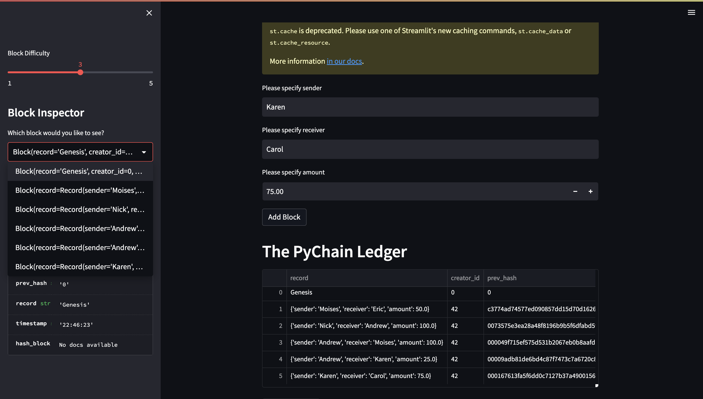
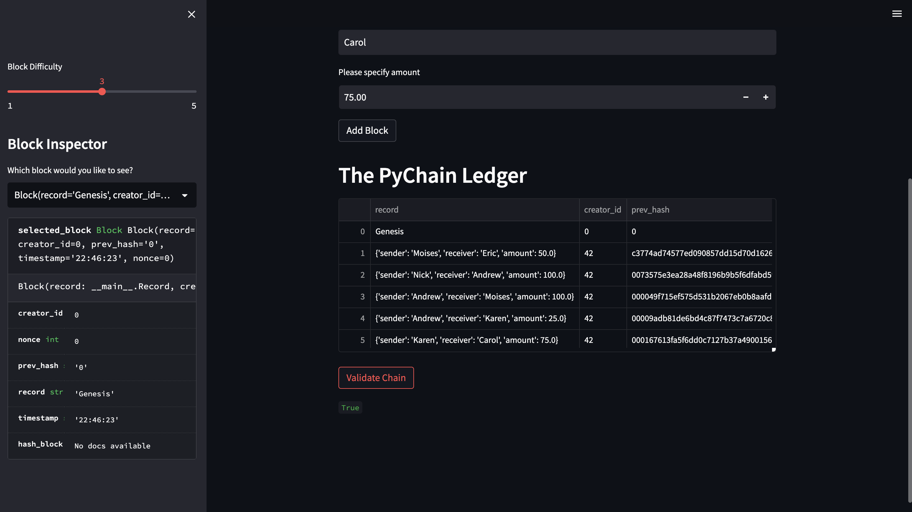

# Module-18-Challenge
This repo contains an appliaction which allows users to input data into a very basic ledger. The integrity of this ledger is mainatained through a chain that connecta each block. If any of the previous blocks are altered, the chain is invalidated. This technology allows for maintaining integrity of transactions. In the application there is also proof of work method for mining the blocks.

## Libraries
To run this application, the streamlit and hashlib libraries are required to be downloaded.

## Adding blocks
Below is a screenshot displaying the functionality of the application as well as the validity of the blockchain created.

